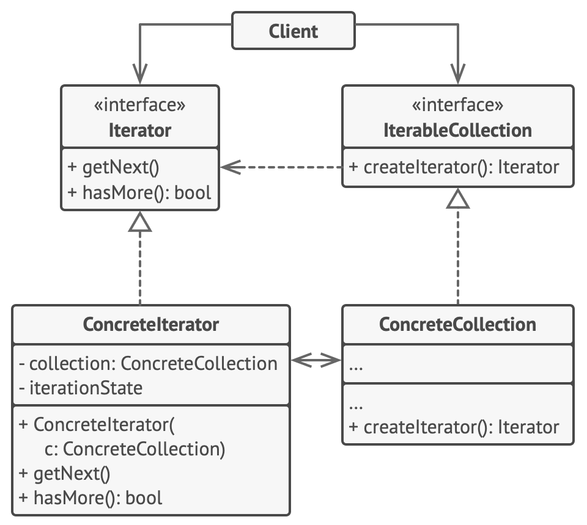

- Iterator is a behavioral design pattern 
  that lets you traverse elements of a collection without exposing its underlying representation (list, stack, tree, etc.).

- Real-World Analogy
  - Think of a TV remote with a "next channel" button:
    - The remote lets you navigate channels without knowing how many channels there are or how they're stored in the TV system.
    - You can "iterate" through channels one by one without worrying about the internal mechanics

- Problem :
  - Consider you have a collection of objects (e.g., a list of users).
    Without the Iterator pattern, you'd have to access elements by directly manipulating the collection's internal structure,
    leading to complex and error-prone code.
  - Challenge: You need to loop through the collection in various ways,
    but changes in the collection's structure (like using an array, linked list, etc.)
    could break your code or make it unnecessarily complex.

- Solution
  - The Iterator pattern solves this by:
    1. Decoupling the traversal logic from the collection, allowing access to the collection without exposing its internal structure.
    2. Providing a uniform way to access elements regardless of the collection’s structure (e.g., whether it's a list, set, or tree).

- Structure 

   

- Applicability / Use Case
 1. You need to traverse through different types of collections (arrays, lists, trees, etc.) without knowing their internal structures.
 2. You want to provide multiple ways to traverse a collection (forward, backward, etc.).
 3. You need to handle collections that may change dynamically (i.e., removing or adding elements).

- Key Components of Iterator Pattern
  1. Collection (Aggregate): The object containing elements to be iterated over.
  2. Iterator Interface: Defines methods for iterating over the collection (e.g., hasNext(), next()).
  3. Concrete Iterator: Implements the iterator interface for a specific collection.
  4. Client: The code that uses the iterator to access collection elements.

- How to Implement
 - In most programming languages, an iterator involves the following key methods:
 - hasNext(): Checks if there are more elements in the collection.  
 - next(): Returns the next element in the collection.
 - remove() (optional): Removes the current element from the collection (in some languages or implementations).

- Pros:
 1. Simplifies Collection Traversal: Iterators decouple the traversal process from the collection, leading to cleaner and more maintainable code.
 2. Consistency: Provides a uniform way to iterate through different types of collections.
 3. Flexibility: Supports multiple types of traversals (forward, backward, etc.).
 4. Encapsulation: The internal structure of the collection is hidden.

- Cons
 1. Overhead: Iterators add a layer of abstraction, which could introduce some performance overhead.
 2. Limited Control: Iterators provide sequential access, so they may not be ideal if you need random access to elements.
 3. Modification Safety: If the collection is modified (e.g., elements added or removed) while iterating, it can lead to issues such as ConcurrentModificationException (in Java).

- Real-Time Implementations
 1. Java Collections Framework: The Iterator interface is widely used to traverse collections like List, Set, and Map.
 2. Python Iterables: Any object that implements __iter__() and __next__() can be used in Python's for loops.
 3. File Parsing: Iterators are often used to read large files line-by-line, processing one line at a time instead of loading the whole file into memory.
