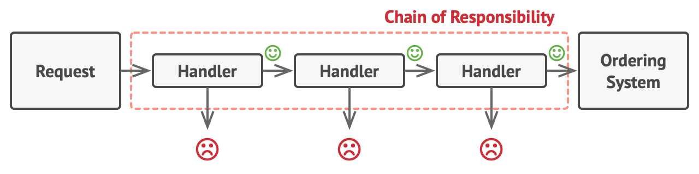

- The Chain of Responsibility is a behavioral design pattern that allows request handling by passing it through a chain of handlers. 
- Each handler in the chain processes the request or passes it to the next handler in line. 
- This decouples the sender of the request from its receiver and allows multiple objects to handle the request dynamically.

-  Real-World Analogy:
   - Imagine a customer service support system where a request is first received by a support representative. 
   - If the representative cannot handle the request, it is escalated to a supervisor. 
   - If the supervisor cannot resolve it, it is passed to a manager, and so on. 
   - Each handler has the option to process the request or pass it further along the chain.

- Problem:
   - In complex systems, multiple components may need to handle a specific task or request. 
     Creating hard-wired connections between request senders and handlers increases coupling 
     and makes the system rigid and difficult to maintain. 
     When a request requires a different handler, changing the entire flow can be tedious and error-prone.

- Solution:
  - The Chain of Responsibility pattern addresses this issue by allowing the request to pass through multiple handlers, 
    where each handler is either responsible for processing the request or forwarding it to the next handler in the chain. 
  - This provides flexibility in adding, removing, or changing handlers without affecting other parts of the system.

- Structure 
   
   

-  Applicability / Use Cases :
   1. When multiple objects can handle a request but the exact handler isn't determined until runtime.
   2. When you want to issue a request to multiple handlers without needing to know which one will handle it.
   3. For scenarios where an object in a hierarchy needs to handle requests in a way that a request passes through the chain of command.

- Key Components:
  - Handler (interface/abstract class): Declares the method for handling requests.
  - Concrete Handlers: Implement the handling logic and determine whether to process the request or forward it.
  - Client: Initiates the request and passes it to the first handler in the chain.

- How to Implement :
  - Event handling systems
  1. Define a common interface for all handlers that declares a method to handle requests.
  2. Create concrete handlers that implement this interface. 
     Each handler either processes the request or passes it to the next handler in the chain.
  3. Client sends a request to the first handler, 
     which traverses the chain until a handler processes the request or the end of the chain is reached.

- Pros:
 1. Decoupling: Sender and receiver of the request are decoupled, providing flexibility in assigning responsibilities.
 2. Flexibility: Handlers can be easily added or removed from the chain.
 3. Open/Closed Principle: You can introduce new handlers without changing the existing code.

- Cons:
 1. No Guarantee of Processing: There may be no handler capable of processing the request, leading to unhandled cases.
 2. Debugging Difficulty: It can be harder to trace the flow of the request through a long chain.

- Common Implementations:
  1. Event handling systems.
  2. Logging frameworks (where logs may be passed to different loggers like file-based, console, etc.).
  3. User access control, where different levels of access may process or reject a user's request.
  4. Logging Frameworks: In logging systems like Log4j or SLF4J, the Chain of Responsibility pattern allows log messages to be processed by multiple logging mechanisms (e.g., console, file, network).
  5. Middleware Request Processing: In web frameworks, the request passes through a series of middleware components, each of which can process or pass the request further.
  6. Validation Systems: In form validation, each validation handler checks a different field or rule, passing unvalidated requests to the next validator.
  7. Technical Support Systems: A customer query may be passed through several levels of customer support (e.g., representative → supervisor → manager), each attempting to resolve the issue.

