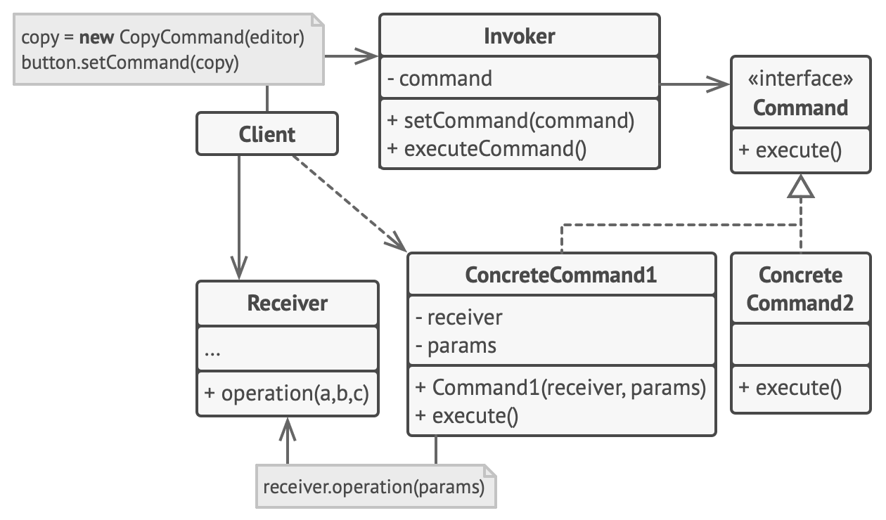

- A command is an instruction given to a computer program to perform a specific action. 
  In software design, the Command Pattern is a behavioral design pattern that turns a request into an object, 
  allowing users to parameterize methods with different requests, delay or queue them, 
  and support undoable operations.

- Real-World Analogy:
  - Imagine a remote control for a TV. 
  - Each button on the remote represents a command (e.g., "increase volume," "change channel"). 
  - The remote itself doesn’t know what the TV will do in detail, 
    but it knows that pressing a button triggers a specific action.

- Problem:
  - In complex systems, direct coupling between the sender of a request and the receiver leads 
    to code that is difficult to extend and maintain. Every time a new action is introduced, 
    the sender must be modified, resulting in rigid code. 
  - The challenge is to decouple the sender and receiver, allowing actions to be more flexible and reusable.

- Structure :
   
  

- Solution:
  - The Command Pattern encapsulates a request as an object. 
  - This allows for parameterizing clients with queues, logging operations,
    and supporting undoable operations. 
  - The client (caller) doesn’t need to know the details of how the request is fulfilled; it simply sends the command.

- Applicability/Use Case:
  1. Undo/Redo functionality in software (e.g., text editors, graphics applications).
  2. Macro recording where a series of commands are saved and executed later.
  3. Job queues where actions are delayed and executed later.
  4. Remote controls in UI programming, where different actions (commands) need to be triggered by user input.

- How to Implement:
    1. Define a Command Interface that declares a method like execute().
    2. Create concrete classes implementing this interface for each action.
    3. Implement an Invoker class that stores the command objects and invokes them when needed.
    4. The Client creates the command objects and associates them with receivers.

- Key Components:
   1. Command: Interface that declares the execute() method.
   2. Concrete Command: Implements the Command interface and defines specific actions.
   3. Receiver: The object that performs the actual action when the command is executed.
   4. Invoker: The object that triggers the command to be executed.
   5. Client: Creates and assigns commands to invokers and receivers.

- Pros:
  1. Decouples the object that invokes the operation from the one that knows how to perform it.
  2. Makes it easy to add new commands without changing existing code.
  3. Supports undoable actions, queues, and logs.

-Cons:
  1. Can result in a large number of small classes, especially in complex systems.
  2. Requires careful implementation to avoid overcomplicating code structure.
  3. Single Responsibility Principle. You can decouple classes that invoke operations from classes that perform these operations.
  4.  Open/Closed Principle. You can introduce new commands into the app without breaking existing client code.

- Real-Time Implementation Examples:
   1. GUI Button Actions: In a desktop application, each button press is tied to a command object that performs an action (e.g., saving a file, printing, etc.).
   2. Task Scheduling: A background task system may queue command objects to be executed later when system resources allow.
   3. Undo Feature in Text Editors: Each action taken by the user (typing, deleting) is encapsulated in a command object. This allows for actions to be undone or redone by reversing the command's execute() method.

- This pattern's flexibility and decoupling make it a popular choice for applications that need to handle complex user interactions or execute actions asynchronously.