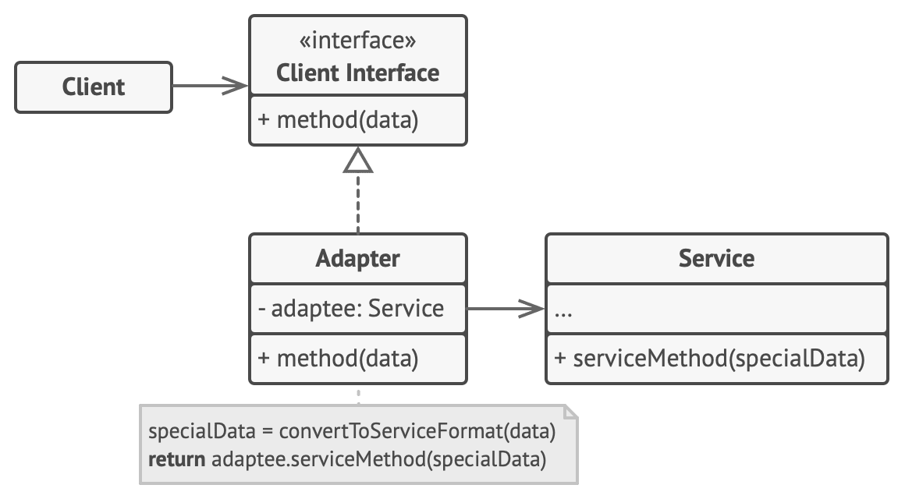

- The Adapter Design Pattern is a structural design pattern that allows two incompatible interfaces to work together. 
- It acts as a bridge between two objects by converting the interface of a class into another interface that a client expects.

- Real world analogy : 
  - When you travel from the US to Europe for the first time, 
    you may get a surprise when trying to charge your laptop. 
    The power plug and sockets standards are different in different countries. 
    That’s why your US plug won’t fit a German socket. 
    The problem can be solved by using a power plug adapter that has the American-style socket and the European-style plug.
  
    
  
- Key Components of the Adapter Pattern:
  1. Target: This defines the domain-specific interface that the client uses.
  2. Client: The client interacts with the objects via the target interface.
  3. Adaptee: This is the existing class with a different or incompatible interface.
  4. Adapter: The adapter class implements the target interface and translates 
     the requests from the client to the adaptee in a way that the adaptee understands.

- Applicability/Use-Case:
  - You use the Adapter Pattern when:
    1. You want to reuse a class, but its interface does not match what the client code expects.
    2. You need to integrate an existing class with an incompatible interface into your application.

- How to Implement :
  1. Create a MediaPlayer interface (Target)
  2. Create an AdvancedMediaPlayer interface (Adaptee)
  3. Create concrete classes implementing the AdvancedMediaPlayer interface
  4. Create an adapter class implementing the MediaPlayer interface (Adapter)

- Advantages of the Adapter Pattern:
  - Increased Reusability: The pattern allows you to reuse legacy code 
    or third-party libraries that do not conform to your interface.
  - Flexibility: It allows systems with incompatible interfaces to work together seamlessly.
  - Separation of Concerns: Keeps the client code clean and focused on its own interface, 
    while the adapter handles the complexities of compatibility.
