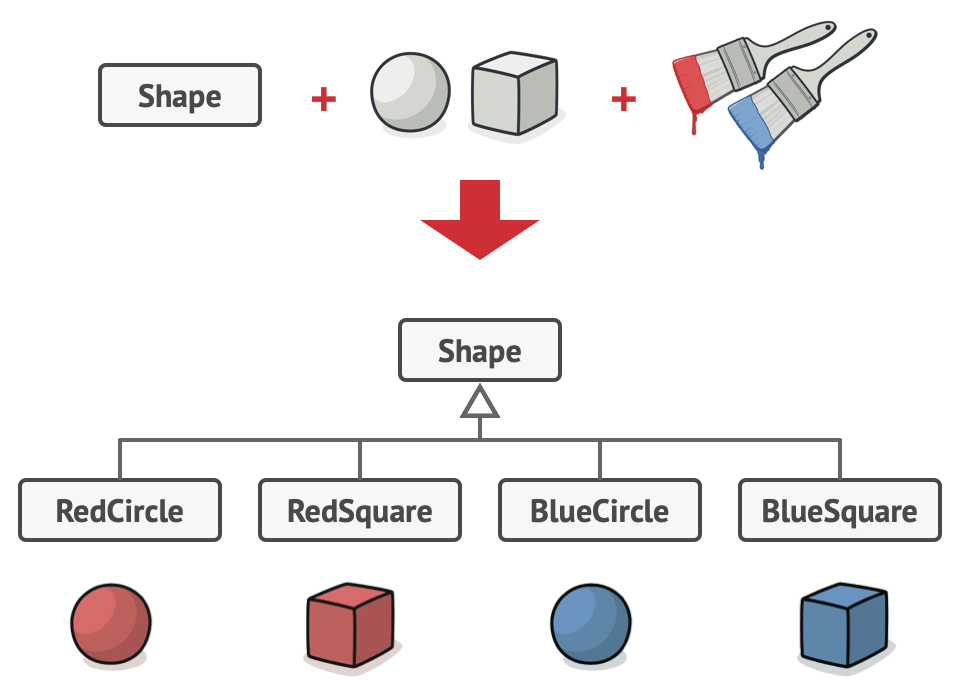
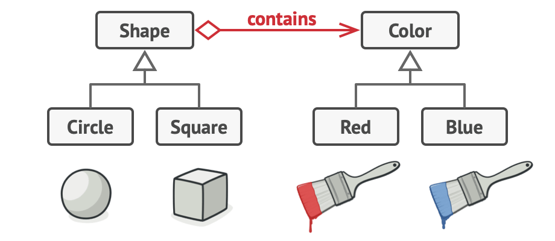
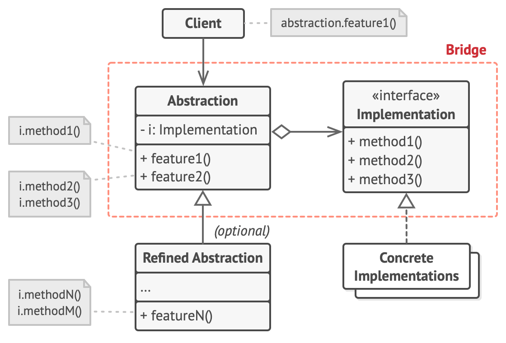

- The Bridge Pattern is a structural design pattern used to separate an abstraction from its implementation so that they can vary independently. 
- This pattern is particularly useful when you have a class hierarchy with multiple dimensions of variability, 
  such as different types of features and different ways to implement them. 
- It is designed to reduce complexity by decoupling abstraction and implementation, making both more flexible.

Real life analogy :
1. Graphic Libraries: A common example is in graphical systems where different devices (printers, screens) 
   might have different implementations of rendering a shape.
2. Cross-platform applications: Used when you need to work with different platforms (e.g., Windows, macOS, Linux) 
   while maintaining a single interface.

- Problem :
   - you have a geometric Shape class with a pair of subclasses: Circle and Square. 
     You want to extend this class hierarchy to incorporate colors, 
     so you plan to create Red and Blue shape subclasses. 
     However, since you already have two subclasses, 
     you’ll need to create four class combinations such as BlueCircle and RedSquare.
     
   - Adding new shape types and colors to the hierarchy will grow it exponentially. 
     For example, to add a triangle shape you’d need to introduce two subclasses, 
     one for each color. And after that, adding a new color would require creating three subclasses, 
     one for each shape type. The further we go, the worse it becomes.
- Solution : 
   - The Bridge pattern attempts to solve this problem by switching from inheritance to the object composition. 
     What this means is that you extract one of the dimensions into a separate class hierarchy, 
     so that the original classes will reference an object of the new hierarchy, 
     instead of having all of its state and behaviors within one class.
     

- Structure :  
    

- Key Components of the Bridge Pattern:
  1. Abstraction: Defines the high-level control logic that relies on the implementation.
  2. Refined Abstraction: Extends the abstraction and adds functionality.
  3. Implementor: Provides the interface for the implementation part, 
     defining methods that are necessary to perform actions in the system.
  4. Concrete Implementor: Provides the actual implementation for the methods defined in the Implementor interface.

- Applicability
  1. When you have multiple layers of inheritance, 
     and you want to avoid an explosion of subclasses by separating different dimensions of behavior.
  2. When you want to vary both abstractions and implementations independently, 
     for example, with different operating systems or device drivers.

- How to Implement
  1. Abstraction (Shape): The Shape class defines the abstraction and references the Color interface.
  2. Implementor (Color): The Color interface defines how colors should be applied.
  3. Concrete Implementor (RedColor, BlueColor): These classes implement the Color interface and provide specific implementations.
  4. Refined Abstraction (Circle, Square): These classes extend Shape and define specific types of shapes.

- Pros
  1. Decoupling: It decouples abstraction from implementation, allowing them to evolve independently.
  2. Scalability: Makes it easy to extend both abstractions and implementations.
  3. Simplified Hierarchies: Prevents a combinatorial explosion of subclasses (like RedCircle, BlueCircle, etc.).

- Cons:
  1. Increased Complexity: The separation between abstraction and implementation might introduce extra complexity in scenarios where it's not necessary.