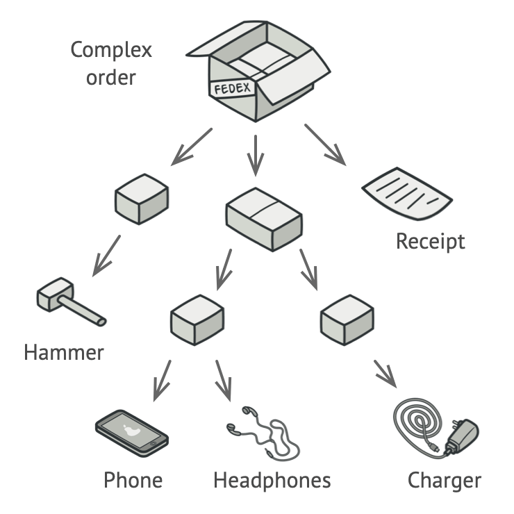
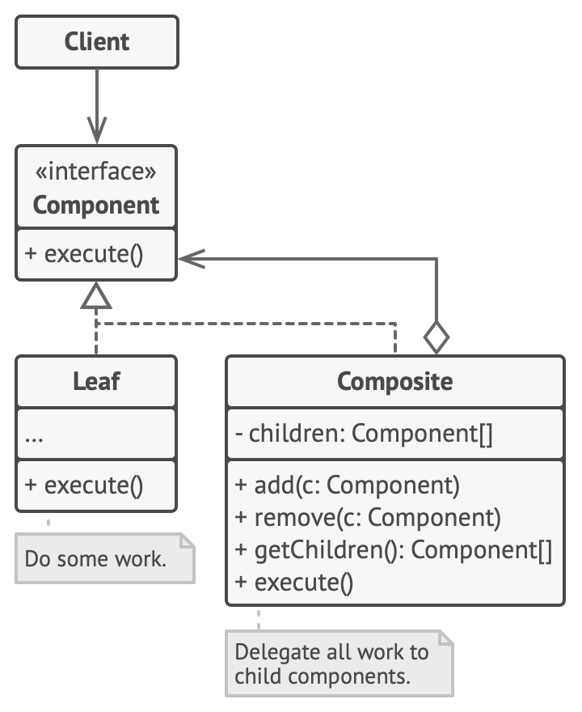

- The Composite Pattern is a structural design pattern 
  that allows you to compose objects into tree-like structures to represent part-whole hierarchies. 
- It allows clients to treat individual objects and compositions of objects uniformly.

- Real life analogy : 
  - Armies of most countries are structured as hierarchies. 
    An army consists of several divisions; 
    a division is a set of brigades, and a brigade consists of platoons, 
    which can be broken down into squads. Finally, a squad is a small group of real soldiers. 
  - Orders are given at the top of the hierarchy and passed down onto each level until every soldier knows what needs to be done.

- Problem : 
   - imagine that you have two types of objects: Products and Boxes. 
   - A Box can contain several Products as well as a number of smaller Boxes. 
   - These little Boxes can also hold some Products or even smaller Boxes, and so on.
    
   - You could try the direct approach: unwrap all the boxes, 
     go over all the products and then calculate the total. 
     That would be doable in the real world; but in a program, 
     it’s not as simple as running a loop. 
     You have to know the classes of Products and Boxes you’re going through, 
     the nesting level of the boxes and other nasty details beforehand. 
     All of this makes the direct approach either too awkward or even impossible. 

- Solution
   - The Composite pattern suggests that you work 
     with Products and Boxes through a common interface which declares a method for calculating the total price.

- Structure 
   

- Key Components of the Composite Pattern:
  1. Component: The base interface or abstract class 
     that declares common operations for both simple and complex objects in the hierarchy.
  2. Leaf: Represents the individual objects that don't have any children. 
     These are the simplest building blocks in the hierarchy.
  3. Composite: Contains children (either Leaf or other Composite objects) 
     and implements methods to add, remove, or access its children.

- Applicability
  - You use the Composite Pattern when:
    1. You need to represent a hierarchy of objects.
    2. You want clients to treat individual objects and compositions uniformly.
    3. You want to simplify client code by treating all objects (both leaf and composite) in the same way.

- How to Implement
  - Suppose we want to model a file system where directories can contain files or other directories, 
    and files don’t have any children. 
    The composite structure allows you to treat both files and directories 
    the same way when performing operations like listing contents.
    1. Component (FileSystemComponent): Defines the common interface for both files and directories.
    2. Leaf (File): Represents the simplest element in the hierarchy (i.e., files that cannot have children).
    3. Composite (Directory): Represents directories that can contain both files and other directories. 
       It implements methods for adding, removing, and displaying its children.

- Pros
1. Uniformity: It allows treating individual objects and composite objects uniformly, making the client code simpler.
2. Scalability: Easily supports adding new types of components or complex hierarchies.
3. Simplified Client Code: The client doesn’t need to distinguish between leaf and composite objects, reducing conditional logic.

- Cons
 1. Overhead: Can introduce complexity in cases where it isn’t necessary, such as when there is no natural part-whole hierarchy.
 2. Inappropriate Use: If the composite structure is overused or misapplied to simple structures, it can lead to unnecessary abstraction.