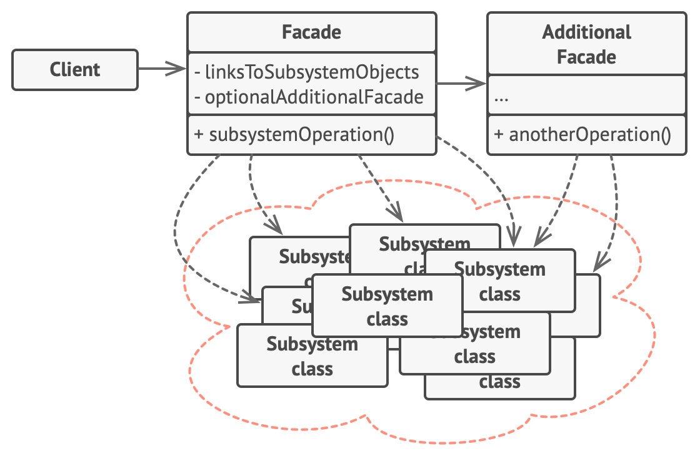

- The Facade Pattern is a structural design pattern that provides a simplified interface 
  to a complex system of classes, libraries, or frameworks. 
- It's used to hide the complexities of the system and make it easier to use. 
- The Facade Pattern wraps a set of interfaces and exposes a single, more straightforward interface to clients.

- Real-World Analogy :
  - When you call a shop to place a phone order, 
    an operator is your facade to all services and departments of the shop. 
  - The operator provides you with a simple voice interface to the ordering system, 
    payment gateways, and various delivery services.

- Problem : 
  - Imagine that you must make your code work with a broad set of objects that belong to a sophisticated library or framework. 
    Ordinarily, you’d need to initialize all of those objects, keep track of dependencies, execute methods in the correct order, and so on.
  - As a result, the business logic of your classes would become tightly coupled to the implementation details of 3rd-party classes, 
     making it hard to comprehend and maintain.

- Solution :
   - A facade is a class that provides a simple interface to a complex subsystem which contains lots of moving parts. 
     A facade might provide limited functionality in comparison to working with the subsystem directly. 
     However, it includes only those features that clients really care about.
   - Having a facade is handy when you need to integrate your app with a sophisticated library that has dozens of features,
     but you just need a tiny bit of its functionality. 
   - For instance, an app that uploads short funny videos with cats to social media could potentially use a professional video conversion library. 
     However, all that it really needs is a class with the single method encode(filename, format). 
     After creating such a class and connecting it with the video conversion library, 
     you’ll have your first facade.

- Structure 
  

- Applicability : 
  1. When you want to simplify a complex system of classes.
  2. When you want to provide a more readable and unified interface to a set of APIs.
  3. When you need to decouple subsystems from the client code.

- How to Implement :
  Let's imagine a Home Theater System with various subsystems such as DVD Player, Sound System, Projector, and Lights. 
  Instead of having the client interact with each subsystem individually, 
  we can create a HomeTheaterFacade that simplifies the process.
    1. Create Subsystem Classes(DVDPlayer, SoundSystem, Projector, Lights)
    2. create Facade Class(HomeTheaterFacade -> watchMovie(), endMovie())
  - Short Note
    1. The client (the HomeTheaterTest class) doesn't need to know how the individual subsystems work.
    2. The HomeTheaterFacade hides all the complexity and provides two simple methods: watchMovie and endMovie.
    3. This makes the system easier to use, cleaner, and more maintainable.

- Pros : You can isolate your code from the complexity of a subsystem.
- Cons : A facade can become a god object coupled to all classes of an app.

- The Facade Pattern is frequently used in frameworks like Spring, 
where complex logic can be hidden behind simple interfaces. 
- For example, Spring's transaction management is built on top of complex transaction-related classes, 
but developers can simply use @Transactional to interact with it.
