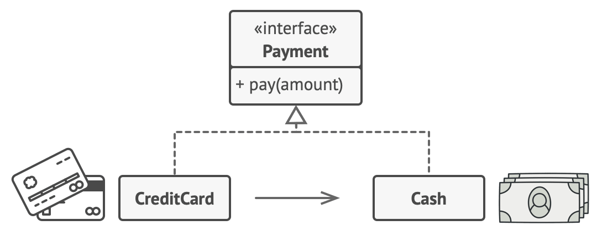
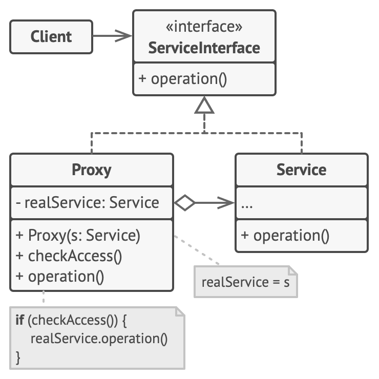

- The Proxy Pattern is a structural design pattern that provides a surrogate or placeholder 
  for another object to control access to it. 
- It involves creating an intermediary that controls or enhances access to the underlying object. 
- This pattern can be useful when you want to add additional functionality,
  like logging, lazy initialization, access control, or caching, without changing the original object.

- Types of Proxies:
1. Virtual Proxy: Manages access to an object that is expensive to create or requires heavy resources, 
   loading it only when necessary.
2. Remote Proxy: Manages communication between a client and a remote object, often used in distributed systems.
3. Protection Proxy: Controls access to an object by checking access permissions.
4. Caching Proxy: Adds caching to an object to enhance performance by storing the result of expensive operations.

- Real-World Analogy :
  - A credit card is a proxy for a bank account, which is a proxy for a bundle of cash. 
  - Both implement the same interface: they can be used for making a payment. 
  - A consumer feels great because there’s no need to carry loads of cash around. 
  - A shop owner is also happy since the income from a transaction gets added electronically 
    to the shop’s bank account without the risk of losing the deposit or getting robbed on the way to the bank.
   

- Problem : 
  - you have a massive object that consumes a vast amount of system resources. 
    You need it from time to time, but not always.
  - You could implement lazy initialization: create this object only when it’s actually needed. 
    All the object’s clients would need to execute some deferred initialization code. 
    Unfortunately, this would probably cause a lot of code duplication.
  - In an ideal world, we’d want to put this code directly into our object’s class, 
    but that isn’t always possible. For instance, the class may be part of a closed 3rd-party library.

- Solution :
   - The Proxy pattern suggests that you create a new proxy class with the same interface as an original service object. 
     Then you update your app so that it passes the proxy object to all the original object’s clients. 
     Upon receiving a request from a client, the proxy creates a real service object and delegates all the work to it.
   - But what’s the benefit? If you need to execute something either before or after the primary logic of the class,
     the proxy lets you do this without changing that class. 
     Since the proxy implements the same interface as the original class, 
     it can be passed to any client that expects a real service object

- Structure 
  

- Applicability : 
  1. Lazy Initialization (Virtual Proxy): Load expensive objects on demand to save memory and resources.
  2. Access Control (Protection Proxy): Control access to sensitive objects by checking user permissions or roles.
  3. Remote Access (Remote Proxy): Manage communication between a client and a remote object, often used in distributed systems (e.g., RMI).
  4. Logging/Monitoring: Log all method calls made to the real object, often used for debugging or monitoring.
  5. Caching (Caching Proxy): Cache the results of expensive operations to avoid unnecessary calculations.

- Key components :
  1. Payment Interface: Both the credit card and bank account must implement the same interface, 
     Payment. This interface has a method to handle payments.
  2. Real Object (BankAccount): The bank account is the real object that holds the actual funds (cash). 
     It implements the Payment interface and processes payments directly.
  3. Proxy (CreditCard): The credit card acts as a proxy to the bank account. 
     It doesn't hold actual money but processes payments on behalf of the bank account.
  4. Client (Consumer): The client (consumer) can use either the credit card or bank account to make payments. 
     The client doesn’t need to know the details of how the payment is handled internally.

- How to Implement :
  a credit card acts as a proxy for a bank account (and by extension, a proxy for cash) 
  In this case, both the credit card and the bank account can implement 
  the same interface because they both perform similar operations: making payments.
    1. Define a Payment interface.
    2. Implement the BankAccount class as the real subject (the object holding the actual funds).
    3. Implement the CreditCard class as the proxy that delegates payment handling to the BankAccount.
    4. Create a Client to test the interaction.

- Pros : 
  1. Lazy Loading: Proxies allow for objects to be loaded on-demand, 
     which saves memory and improves performance when the object is not always needed.
  2. Controlled Access: The proxy can control access to the real object, 
      for example, by checking permissions or logging access.
  3. Decoupling: The proxy decouples the client from the complexities of the real object 
     (e.g., resource-heavy operations, remote access).
  
- Cons :
  1. Increased Complexity: Introducing proxies adds more classes and complexity to the system.
  2. Performance Overhead: Although proxies can improve performance in some cases (e.g., lazy loading), 
     they can also introduce slight performance overhead due to the extra level of indirection.

- Common Proxy Pattern Implementations:
  - Java RMI (Remote Method Invocation) uses a proxy to communicate with objects in different JVMs.
  - Spring AOP (Aspect-Oriented Programming) uses proxies to add cross-cutting concerns like logging, 
    security, and transactions.
